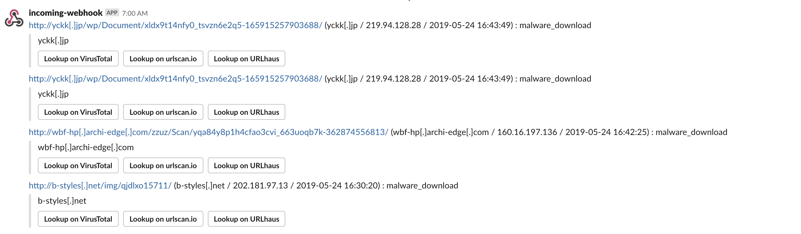

# URLhaus monitor

[](https://travis-ci.org/ninoseki/urlhaus_monitor)
[](https://coveralls.io/github/ninoseki/urlhaus_monitor?branch=master)

A monitoring tool for [URLhaus](https://urlhaus.abuse.ch/) feeds.

## Features

- URLhaus feeds lookup by AS number, country code and TLD.
- Slack notification.
- Caching.

## Installation

```bash
gem install urlhaus_monitor
```

## Usage

```bash
$ urlhaus_monitor
Commands:
  urlhaus_monitor help [COMMAND]               # Describe available commands or one specific command
  urlhaus_monitor lookup_by_asn [ASN]          # lookup by a given asn
  urlhaus_monitor lookup_by_country [COUNTRY]  # lookup by a given country code
  urlhaus_monitor lookup_by_tld [TLD]          # lookup by a given tld
```

## Configuration

### Slack

Please set the following environmental variables for enabling Slack notification.

- `SLACK_WEBHOOK_URL`: A Slack webhook URL.
- `SLACK_CHANNEL_NAME`: A Slask channel name which will be notified.

## Screenshots

```bash
urlhaus_monitor lookup_by_tld jp
```



## License

The gem is available as open source under the terms of the [MIT License](https://opensource.org/licenses/MIT).
